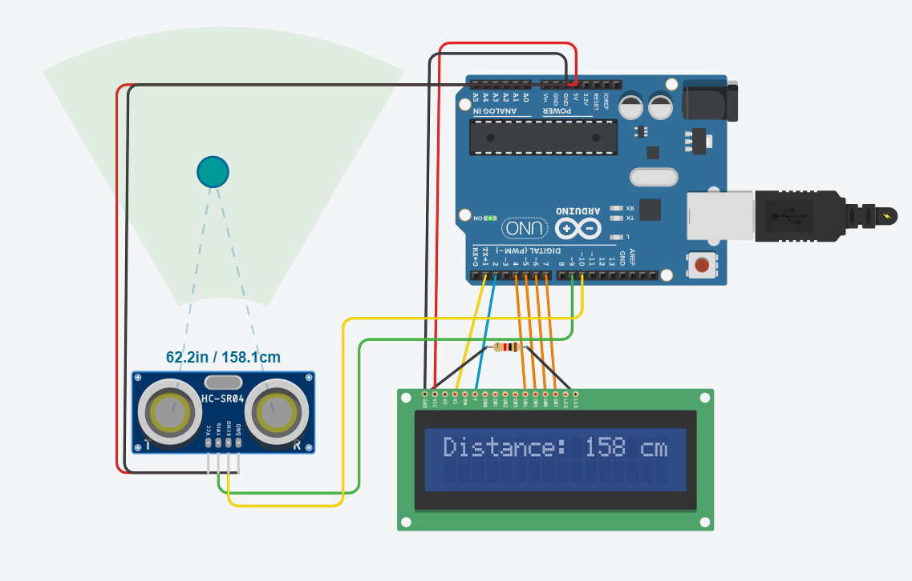
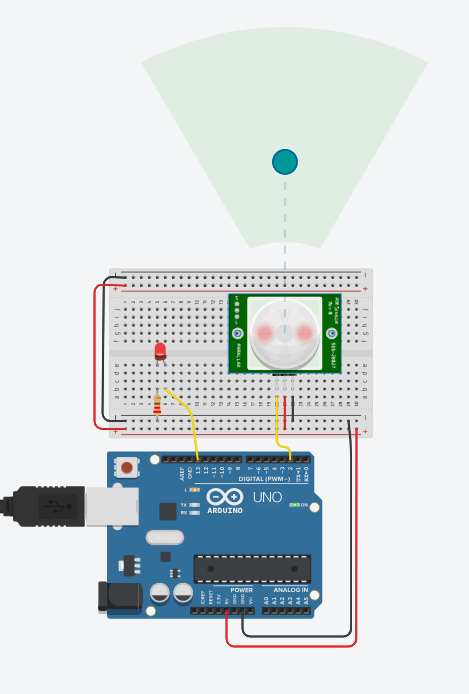

# week4_sensors

for task 3:
making a simulation in tinkercad for arduino distance sensor and a digital sensor.

1-the ultrasonic distance sensor using LCD screen to read the distance:

2-the digital sensor (PIR motion sensor) :

